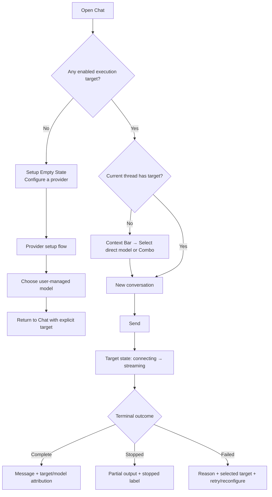

# Phase 7 — IVAI UI/UX Redesign Blueprint

> **Status:** Research and planning complete; implementation has not started.
>
> **Product invariant:** IVAI is a Local-first, Backendless, BYOK Agent Harness. The redesign improves comprehension, hierarchy, state visibility, and accessibility. It does **not** add telemetry, a backend, provider/model auto-selection, a provider adapter, or a new Agent tool.

## 1. Design North Star

IVAI should feel like a **calm local control room for AI work**, not a generic chatbot and not a provider-branded client. The experience must help a user answer four questions at any moment:

1. **What am I working in?** The active project and conversation.
2. **What will execute this action?** The explicit provider/model or ordered Combo selected by the user.
3. **What is happening now?** A visible execution state with an available safe action.
4. **What control do I retain?** The ability to inspect, stop, retry, reconfigure, deny, or allow once.

The visual language combines an indigo night-workspace foundation with aurora emerald and violet accents. Gradients are identity and atmosphere, never a substitute for a semantic status color, control state, label, or readable text.

## 2. User Jobs and UX Principles

| Primary job | Current risk | Redesign principle | Design outcome |
|---|---|---|---|
| Start a local AI conversation | User sees target, project, filter, new-chat and empty-state controls together. | **One next safe action.** | If no target exists, the empty state leads directly to provider setup. If target exists, it leads directly to a new chat. |
| Configure a BYOK provider | One long dialog mixes provider family, trust, credential and model decisions. | **Progressive disclosure, explicit trust.** | A guided four-step sheet separates family, trust/endpoint, credential, and model/capability review. |
| Build reliable fallback | Ordered Combo meaning is hidden behind checkboxes. | **Make routing intent inspectable.** | A Combo builder shows ordered candidates, compatibility, and an explicit confirmation before saving. |
| Run a bounded Agent | Profiles, runs, traces and approvals compete in one list. | **Separate configuration from live operation.** | A profile library opens a focused run workspace with timeline, trace and approval state. |
| Understand an error | Generic error states do not consistently identify target, stage, or next safe action. | **Explain then recover.** | Every error surfaces target, reason category, fallback outcome, and non-destructive next steps. |

These choices apply the visibility-of-system-status principle and the AI interaction principles of identity, capability, rationale and privacy transparency.[9][10]

## 3. Information Architecture

### 3.1 Product objects remain unchanged

| Object | User control retained | Presentation in Phase 7 |
|---|---|---|
| Provider connection | Family, endpoint, HTTPS trust mode, enabled state | Connection card and guided setup flow |
| Account | Account label and credential/no-auth mode | Nested connection detail; credential state never reveals the secret |
| Model | User-selected model ID and declared capabilities | Model row / target picker |
| Combo | Explicit ordered candidates | Ordered Builder and read-only target detail |
| Project | Local workspace boundary | Project Hub with chats, Agent activity, and project metadata |
| Chat | Thread, project assignment, explicit target | Chat workspace with Context Bar and Session Drawer |
| Agent profile | Explicit target, bounded tools, ceiling values | Profile card + configuration sheet |
| Agent run | Goal, local trace, cancel state | Live Run workspace/timeline |
| Write approval | One proposal, preview, Allow once/Deny | Blocking review sheet with clear consequence |

### 3.2 Adaptive navigation

| Window class | Global navigation | Secondary navigation | Content behavior |
|---|---|---|---|
| Compact phone | Bottom navigation: **Chat**, **Agents**, **Workspace**, **Connections**, **Settings** | Chat Session Drawer; sheets for filters, targets and action menus | One focused task per screen; sheets are full-height when content is complex. |
| Medium tablet/foldable | Navigation rail with the same five destinations | Contextual list pane for Chat sessions or Workspace items | Content takes remaining width; do not duplicate controls. |
| Expanded tablet/desktop | Permanent navigation rail + optional persistent session/project pane | Selected task detail remains dominant | Three-pane layout only when each pane remains legible; no behavioral fork from compact mode. |

**Connections** is a presentation-level parent for two existing management surfaces: **Providers** and **Combos**. This groups the setup journey without changing the provider or router data layers. Chat history is no longer a global navigation container; it becomes a task-specific Chat Session Drawer.

### 3.3 Destination contracts

| Destination | First hierarchy level | Primary action | Must show |
|---|---|---|---|
| Chat | Active conversation / onboarding state | Send message or configure first target | Target, project, execution status, stop/retry path |
| Agents | Profile library or active run workspace | Start local run | Explicit target, bounded policy, current run state, approval state |
| Workspace | Project Hub | Open/create local project | Project-local chats, runs, files activity summary, no cloud claims |
| Connections | Provider list / Combo list | Add provider or create Combo | HTTPS trust and credential status, no default selection |
| Settings | App and privacy controls | Change theme / data action | Local-first privacy explanation, destructive-data confirmation |

## 4. Flow Architecture

### 4.1 First safe action in Chat

### 4.2 Provider setup: four deliberate steps

| Step | User decision | Required UI | Guardrail |
|---|---|---|---|
| 1. Connection family | Choose cloud preset, local device HTTPS, private-LAN HTTPS, or advanced custom | Preset cards with concise protocol labels; no default preselected | State explicitly that a preset creates no connection or request. |
| 2. Endpoint and trust | Name the connection; enter/review HTTPS endpoint | Endpoint field, trust-mode explanation, local confirmation only when applicable | Block HTTP, discovery and invalid local hosts before save. |
| 3. Account and credential | Set account label; choose API key/no-auth when permitted | Vault explanation, password field, no-auth disclosure | Never show stored secret again; no placeholder token. |
| 4. Model and capability review | Enter model ID and declare capabilities | Capability chips plus review screen | Model remains user-selected; display a concise final summary before saving. |

### 4.3 Agent run workspace

| Run state | Visual treatment | User action | Semantics |
|---|---|---|---|
| Planned | Neutral timeline node | Start | `stateDescription = "Ready"` |
| Running | Calm indeterminate/progress treatment; no frantic animation | Cancel | `stateDescription = "Running step 2 of 8"` |
| Awaiting approval | Violet/amber attention card with locked-file preview | Allow once / Deny | `stateDescription = "Awaiting one-time write approval"` |
| Completed | Emerald terminal node | View trace / start new run | `stateDescription = "Completed"` |
| Stopped / Failed | Crimson terminal node with safe reason | Retry / edit target / inspect trace | `stateDescription = "Stopped"` or safe failure category |

## 5. IVAI Design System

### 5.1 Token hierarchy

Phase 7 introduces `IvaiTokens` and composable extensions. Screens consume semantic tokens and shared components; screens must not introduce raw brand hex values, direct `Brush` constructions, or arbitrary shape/spacing values.

| Token family | Base decisions | Use |
|---|---|---|
| `color` | Preserve existing approved light/dark IVAI palettes: indigo foundation, jade primary, violet secondary, cyan informational accent, error/warning/success semantics. | `actionPrimary`, `surfaceCanvas`, `surfaceRaised`, `borderSubtle`, `textPrimary`, `stateRunning`, `stateAwaitingApproval`, `stateError`. |
| `type` | Keep system default font fallback for Persian/Arabic/English coverage. Body uses content-aware direction; monospace + forced LTR only for IDs, endpoints, model IDs, code and protocol payloads. | `screenTitle`, `sectionHeading`, `body`, `meta`, `codeLabel`. |
| `space` | 4dp base: 4, 8, 12, 16, 24, 32, 48. | Eliminate scattered one-off padding values. |
| `shape` | 8dp small control, 12dp field/chip, 16dp card, 20dp sheet, full round only for icon-only actions. | Visual rhythm and predictable affordance. |
| `elevation` | Flat canvas, 1dp raised card, 3dp active surface, 6dp sheet/FAB. | Avoid stacked-card heaviness. |
| `motion` | 100ms state, 180ms navigation/selection, 240ms sheet; ease-out; motion respects Android animation scale. | Explain movement; never animate critical status away. |

### 5.2 Brand and gradient rules

| Allowed | Prohibited |
|---|---|
| Brand gradient in onboarding halo, empty-state glyph, primary hero tile, and non-textual divider/edge glow. | Gradient beneath body text, labels, form values, error copy, or status badges. |
| Solid semantic colors for selected, enabled, error, warning, approval and disabled states. | Using emerald/violet/cyan gradient to convey a state that needs a persistent semantic meaning. |
| Solid fallback for every decorative gradient. | Creating visual contrast that depends only on the gradient image. |

### 5.3 Component library

| Component | Role | Required contract |
|---|---|---|
| `IvaiScreenScaffold` | Standard app bar, inset and window-size behavior | Consistent page title, action slot, test tag root. |
| `ConversationContextBar` | Target + project + execution state | States current explicit target; target picker action; no auto-selection. |
| `ExecutionStatusBanner` | Connecting, streaming, fallback, stopped, error | Target label, short state, stop/retry action, semantic state description. |
| `IvaiTargetChip` | Direct model or Combo reference | Icon, label, availability state, ellipsis, accessible action label. |
| `IvaiStateCard` | Empty/loading/offline/error/success state | One primary action, optional secondary action, icon is decorative unless it carries unique information. |
| `ProviderConnectionCard` | Connection overview | Family, endpoint/trust state, account credential state, model count, enable switch, contextual delete action. |
| `SetupStepperSheet` | Provider/Combo guided setup | Progress semantics, validation on current step, safe cancel. |
| `ComboBuilder` | Ordered fallback management | Explicit order; candidate labels; review before save; no implicit member. |
| `AgentRunTimeline` | Run state and safe trace | Ordered positions, status descriptions, selectable safe summaries. |
| `WriteApprovalSheet` | One write decision | Target path, preview, allow-once/deny consequences, no persistent grant. |
| `ProjectHubCard` | Local project navigation | Chats, runs and local metadata with clear empty state. |

## 6. Accessibility and BiDi Acceptance Criteria

| Requirement | Phase 7 testable criterion |
|---|---|
| Semantics | Every non-decorative icon has a meaningful label; custom actions have `Role` and `stateDescription`; section titles are semantic headings. |
| TalkBack | Target changes, terminal execution outcomes and approval-required state are understandable by focus navigation. Use polite live regions only for terminal state changes. |
| Touch | Interactive controls target at least 48dp on compact layouts. |
| Contrast | All normal text semantic foreground/background pairs achieve WCAG AA (≥4.5:1); large text and non-text UI affordances meet their appropriate contrast threshold. |
| RTL/BiDi | App shell mirrors per system locale. Persian/Arabic and mixed content are exercised in every redesigned destination. IDs, URLs, code and model strings remain narrow LTR blocks with copied text isolated from prose. |
| Text scaling | No critical control clips at 200% font scale; labels wrap or switch to an overflow/action menu. |
| Motion | State changes remain understandable with animations disabled and without color-only meaning. |

Compose semantics exist specifically to provide component meaning to accessibility services and test frameworks; Phase 7 treats this as a component requirement, not a testing afterthought.[8]

## 7. UX Research Plan — Outside the Product Runtime

The listed feedback/analytics tools must not be embedded into IVAI during Phase 7 because that would introduce tracking, network behavior, or an analytics backend inconsistent with the current Backendless default. Research is conducted **outside the application runtime**.

| Method | Goal | Suggested neutral tool class | Participant prompt / metric |
|---|---|---|---|
| Discovery survey | Identify provider setup anxiety, vocabulary and trust expectations. | Google Forms, LimeSurvey CE, Formbricks survey link. | `What would you expect “Combo”, “Connection”, and “Trust local endpoint” to mean?` |
| Open card sort | Test information architecture labels and grouping. | kardSort, xSort, spreadsheet-moderated card sort. | Group: Chat history, Projects, Providers, Models, Combos, Agent profiles, Runs, Settings. |
| Tree test | Validate proposed five-destination navigation. | Paper/Figma prototype or external tree-testing service. | Find: `Change model`, `Review write`, `See provider trust`, `Open project chat`. |
| Moderated task test | Validate core safety flows with early prototype. | Screen share / prototype; no product instrumentation. | Completion, confusion points, recovery success, trust comprehension. |
| Post-prototype feedback | Compare two hierarchy options. | Short anonymous survey. | First-click path, perceived control, clarity rating, open feedback. |

Microsoft Clarity technically supports mobile/Compose features, and Matomo supports Android analytics; both remain deliberately excluded from the runtime because their deployment would add telemetry/server infrastructure beyond current Phase 7 scope.[3][4]

## 8. Non-Goals and Release Safety

The following are **not** Phase 7 work:

- New provider adapters, automatic provider/model selection, model discovery behavior, or altered HTTPS trust policy.
- New Agent tools, background agents, shell/Termux/Shizuku/Accessibility integration, or permanent write grants.
- Cloud sync, remote error logging, analytics/session replay SDK, central backend, account sign-in, or feedback SDK.
- Release of Alpha before existing physical-device, signing and network evidence gates are complete.

## References

[1]: https://cssgradient.io/gradient-backgrounds/ "CSS Gradient – Gradient Backgrounds"
[2]: https://www.aura.build/design-systems/ "Aura – AI Website Builder"
[3]: https://learn.microsoft.com/en-us/clarity/mobile-sdk/ "Clarity for Mobile Apps — Microsoft Learn"
[4]: https://matomo.org/faq/general/what-features-of-matomo-analytics-are-supported-when-tracking-mobile-app-analytics-using-android-or-ios-sdk/ "Matomo mobile SDK feature support"
[5]: https://openreplay.com/product/feature/mobile/ "OpenReplay Mobile Session Replay"
[6]: https://www.nngroup.com/articles/card-sorting-definition/ "Card Sorting: Uncover Users' Mental Models — Nielsen Norman Group"
[7]: https://developer.android.com/develop/ui/compose/designsystems/material3 "Material Design 3 in Compose — Android Developers"
[8]: https://developer.android.com/develop/ui/compose/accessibility/semantics "Semantics — Android Developers"
[9]: https://www.nngroup.com/articles/visibility-system-status/ "Visibility of System Status — Nielsen Norman Group"
[10]: https://www.nngroup.com/articles/dimensions-of-ai-chatbots/ "The 5 Dimensions of Site-Specific AI Chatbots — Nielsen Norman Group"
