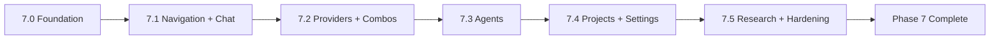

# Phase 7 — UI/UX Redesign Execution Plan

> **Decision status:** Proposed implementation plan. Execute only after the design blueprint and navigation vocabulary are accepted.
>
> **Implementation principle:** Each sub-phase changes one coherent visual/interaction layer, runs full regression, receives its own PR, and is merged only after CI passes. No sub-phase changes the provider, router, Agent or data-layer contract.

## Phase 7.0 — Design Foundation and Test Harness

**Goal:** Establish a reusable IVAI design system before touching feature screens.

| Work item | Deliverable |
|---|---|
| Semantic tokens | `IvaiTokens`: color roles, spacing, shape, elevation, motion, state colors; remove direct raw colors/brushes from new screen code. |
| Core primitives | `IvaiScreenScaffold`, `IvaiPageHeader`, `IvaiStateCard`, `IvaiTargetChip`, `ExecutionStatusBanner`, semantic section heading. |
| Accessibility utilities | Standard modifiers for heading, state description, live-region terminal event, minimum touch target, stable test tag. |
| Screenshot harness | Test matrix helper for light/dark, English/RTL/mixed BiDi, normal/error/empty/loading states. |
| Brand-coherence checklist | PR-review checklist that compares every new surface against the VA icon: approved indigo/emerald/violet token use, rounded shape scale, coherent Material iconography, and no unrelated visual language. |

**Scope boundary:** No navigation restructuring and no behavior change.

**Acceptance gate:** Core components have semantic and screenshot tests; contrast table is current; all existing screens compile unchanged on the new theme layer; every redesigned primitive passes the VA icon brand-coherence checklist.

---

## Phase 7.1 — Adaptive Navigation and Chat Foundation

**Goal:** Remove global navigation density and make first Chat action unambiguous.

| Work item | Deliverable |
|---|---|
| Navigation | Compact bottom bar, medium rail, expanded rail/pane rules; retain five functional destinations. |
| Chat Session Drawer | Move history search, thread list and project filtering out of global drawer. |
| Conversation Context Bar | One target + project + overflow row; persistent explicit execution target. |
| Chat onboarding | State-aware empty states for no provider, no target, no thread and ready-to-chat. |
| Composer | Target-aware placeholder; clear sending/streaming/Stop affordance. |

**Scope boundary:** Does not change chat persistence, provider routing, message protocol or model target rules.

**Acceptance gate:** Screenshot coverage for compact/expanded, no-target, target-ready, streaming, stopped, error, empty thread, Persian/Arabic mixed content. Existing target-selection tests still pass.

---

## Phase 7.2 — Provider and Combo Setup Experience

**Goal:** Make BYOK onboarding learnable without weakening any trust or credential rule.

| Work item | Deliverable |
|---|---|
| Provider list | Connection cards with trust/auth/model availability and clear local/cloud categorization. |
| Four-step provider sheet | Family → endpoint/trust → account/credential → model/capability review. |
| Trust communication | Distinct Remote HTTPS, local-device HTTPS, and private-LAN HTTPS cards; clear confirmation state. |
| Combo builder | Ordered candidates with reorder controls, capability summary and review before save. |
| Empty states | Contextual progression: provider → account/credential → model → Combo. |

**Scope boundary:** No automatic model discovery, connection testing, credential reveal, HTTP support, local discovery or provider defaults.

**Acceptance gate:** All existing endpoint policy and migration tests pass; every step has semantic labels; no provider is created until explicit final save; no secret appears in screenshot/test text.

---

## Phase 7.3 — Agent Profile and Live Run Workspace

**Goal:** Convert the list-heavy Agent view into a comprehensible local-operation workspace.

| Work item | Deliverable |
|---|---|
| Profile library | Clear cards showing target, bounded tools, project scope and limits. |
| Profile editor | Progressive target/tool/project selection with explicit safety language. |
| Run workspace | Timeline, terminal state, trace inspector and cancel control. |
| Approval sheet | File path, bounded preview/diff, one-time allow/deny decision and post-decision result. |
| Recovery UI | Safe reason categories, current target, retry/edit-target routes. |

**Scope boundary:** No new tools, autonomous/background runs, changed runtime limits or always-allow permission.

**Acceptance gate:** Existing Agent approval/run trace tests pass; TalkBack semantics state path and consequence; visual states cover running, awaiting approval, completed, cancelled, failed and denied.

---

## Phase 7.4 — Project Hub, Settings and Cross-screen Polish

**Goal:** Make project boundaries understandable and finish all product-surface consistency work.

| Work item | Deliverable |
|---|---|
| Project Hub | Local project overview: chats, Agent activity, files/activity summary and intentional quick actions. |
| Settings | Simplified sections: Appearance, Connections shortcut, Privacy commitments, Local data. |
| Shared states | Uniform empty/loading/offline/error/success treatment. |
| Copy system | Remove vague futuristic wording; use direct, precise and provider-neutral microcopy. |
| Theme parity | Final dark/light polish; no brand drift or contrast regression. |

**Scope boundary:** No change in project file isolation, data deletion semantics, export/import behavior or app permissions.

**Acceptance gate:** All five destinations pass visual, semantics and RTL regression; no raw-color/raw-spacing lint rule violations in redesigned screens; documentation/screenshots updated.

---

## Phase 7.5 — UX Research Validation and Hardening

**Goal:** Validate IA and safety comprehension before declaring the redesign complete.

| Method | Sample / protocol | Success criterion |
|---|---|---|
| Open card sort | 5–8 representative target users; Provider, Account, Model, Combo, Project, Agent, Run, Settings cards. | ≥70% category agreement for primary navigation terms, or revise labels. |
| Tree test | Find target change, provider trust setting, Combo creation, write approval, project chat. | ≥80% direct-task success in prototype. |
| Moderated usability test | Five tasks on an interactive prototype / debug build, no product telemetry. | Users can state active target, explain one-time approval, and recover from a failed target without researcher help. |
| Heuristic review | Visibility, user control, error recovery, minimalism, consistency and accessibility. | No unresolved P0/P1 usability finding. |
| Device/accessibility sweep | Physical compact/medium device, dark/light, font scale, Force-RTL, TalkBack. | All task-critical controls reachable, understandable and non-clipping. |

**Scope boundary:** No embedded analytics or session replay. Surveys/card sorts are conducted outside the product runtime with voluntary participation.

**Acceptance gate:** Findings and changes are documented in `docs/PHASE7_UIUX_VALIDATION.md`; full build/test/lint and screenshot suite pass; no regression in Local-first/Backendless/BYOK invariants.

## Delivery Sequence



## Mandatory Gate for Every Sub-phase

```bash
export JAVA_HOME=/usr/lib/jvm/java-21-openjdk-amd64
export ANDROID_HOME=/tmp/android-sdk-ivai
./gradlew clean assembleDebug testDebugUnitTest lintDebug --no-daemon --console=plain
git diff --check
```

Each sub-phase receives its own feature branch and PR. Wait for Secret Scan and Build/unit-test/lint CI gates, then squash merge and restore main branch protection using the established protected-branch workflow.

## Dependencies and Decisions Before Implementation

| Decision | Default proposal | Why it is needed |
|---|---|---|
| Product language for first release | English system copy with strong Persian/Arabic/BiDi support; localized UX copy is a separate content pass. | Prevents accidental partial translation while retaining readability for core target users. |
| Navigation vocabulary | `Chat`, `Agents`, `Workspace`, `Connections`, `Settings`. | Reduces duplication between Provider, Router, Project, chat history and global drawer. Validate in card sort. |
| Dynamic color | Off by default. | Fixed IVAI brand identity and contrast-reviewed semantic palette take precedence. |
| Analytics/session replay | Not included. | Preserves Backendless/Local-first runtime. Research occurs externally and voluntarily. |
| UI references | Material 3 foundations + IVAI brand blueprint. | Avoids copying a web design system into a native mobile context. |

## Phase 7 Completion Definition

Phase 7 is complete only when every redesigned destination uses the IVAI token/component layer and visibly aligns with the approved VA launcher icon identity; all flows preserve explicit provider/model/Combo/Agent control; dark/light/RTL/semantics coverage exists; external research findings are documented; and CI/regression gates are green. Alpha release remains independently blocked by the physical-device, HTTPS local network, signing, checksum and release-note gates listed in `docs/ALPHA_RELEASE.md`.
